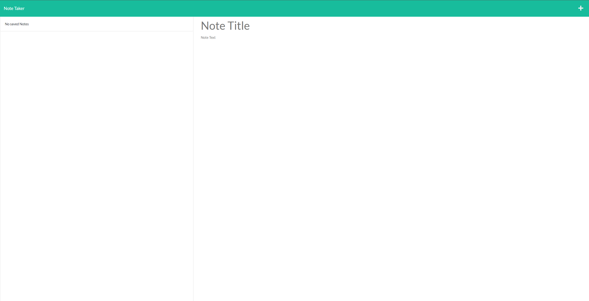
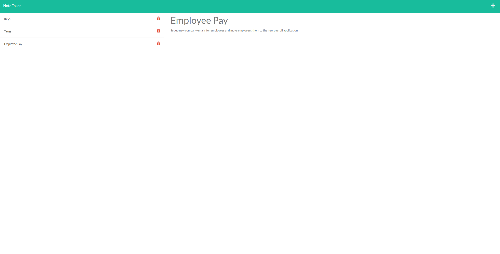

# Note Taker
## Table of Contents
  - [Description](#description)
  - [Usage](#usage)
  - [Known Issues](#known-issues)
  - [Demo](#demo)

## Description
This application is a note taker. It takes two inputs from the user: the note title and note body. Saved notes will appear on a list on the side, to be accessible at any time. Notes can also be deleted by clicking the red trashcan button.

## Usage
To use this application, simply visit the Heroku deployment <a href='https://note-taker-by-ghassan.herokuapp.com/notes'>here</a>.

## Known Issues
- When deleting a note, the page does not update and the note will not immediately disappear from the note list, but it will be removed from the json file. Refreshing the page, however, will update the page and remove the note from the list.

## Demo

